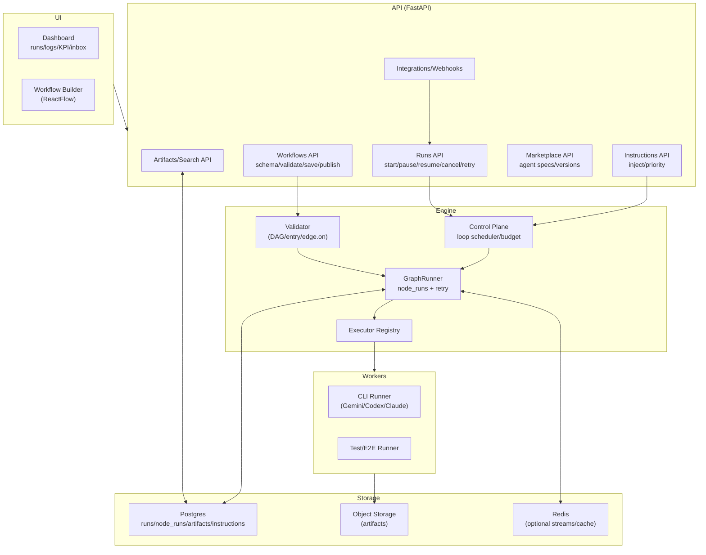
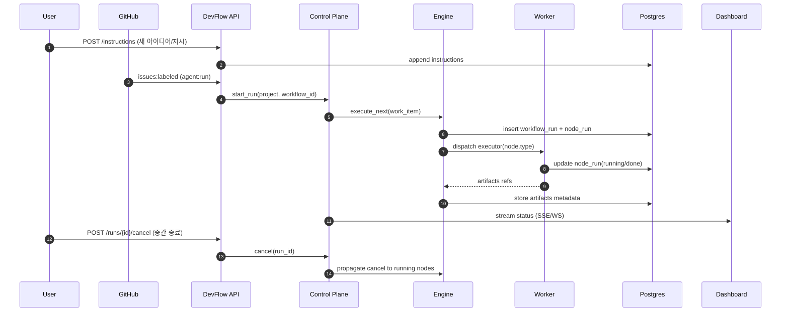

> [!IMPORTANT]
> 우선순위: `ex-code` 내부 코드를 분석해 현재 프로젝트에 모든 기능을 구현한다.

# SPEC

        - Repository: manbalboy/agent-hub
        - Issue: #69
        - URL: https://github.com/manbalboy/agent-hub/issues/69
        - Title: [초장기] 해당 워크 플로를 각각 상세하게 수정 구현할수 있는 형태로 개발해주세요

        ## 원본 요청

        워크플로 각각 조정할수 있어야하면 페이지가 더 생성되도됨 

대시보드만 있으면안되고 수정 할수 있는 형태로 구현해 나가야함 

기능중심에 확장을 가져가야함  지금 구현되어있는 상황은 아무것도 할수 없는 형태임

workspaces/main 상대경로 안의 소스를 분석해보고 그기능들은 다 최소한의 기능들로 구현되어있어야함 구현이 안되어있으면 구현플랜을 짜고 우선수위 제일 첫번째로 짜서 동일 기능들을 이식하려고해야함 

# DevFlow Agent Hub 확장 설계서

## 요약

manbalboy/gift는 entity["company","GitHub","code hosting platform"] Issue에 `agent:run` 라벨이 붙으면 Job을 생성해 큐에 적재하고, 별도 Worker가 **고정된 단계(이슈 읽기→계획→구현→리뷰→수정→테스트→PR)** 를 실행해 PR을 만드는 FastAPI MVP입니다(manbalboy/gift:README.md). 웹훅(`issues`) 수신 후 `X-Hub-Signature-256` HMAC 서명을 검증하고, 상태/단계/로그/PR URL을 저장하며 대시보드에서 관측합니다(manbalboy/gift:README.md). 또한 실패 시 **최대 3회 재시도**, 최종 실패 시 `STATUS.md` 저장·WIP Draft PR 시도, **자동 머지 금지**를 명시하고, 24/7 실행을 위해 systemd 예시 및 “Postgres 확장·멀티 워커/분산 큐·SSE/WebSocket 실시간 로그” 같은 후속 확장 포인트를 제시합니다(manbalboy/gift:README.md). DevFlow 확장은 이 기반을 그대로 활용하되, 목표를 “사람이 아이디어를 던지면 24시간 지속적으로 고도화하며(새 지시 반영 가능), 사람은 시작/종료만 제어하는 자동 개발자 플랫폼”으로 끌어올리기 위해 **워크플로우 실행 엔진 전환(그래프+내구 실행)**, **지시 주입/중단/재개(Control Plane)**, **Agent SDK/Marketplace 표준화**, **아티팩트 중심 Workspace**, **시각적 워크플로우 빌더**, **통합 이벤트 버스**를 단계적으로 구현합니다. citeturn12view0turn14view0turn12view2turn16view0turn12view4

## 목적 및 핵심 개념

DevFlow의 핵심은 “Workflow(정의) ≠ 코드(구현)”를 분리하는 것입니다. gift가 이미 선언한 n8n 스타일 목표(노드/엣지 시각 구성, 저장된 정의 기반 실행, 앱/트랙별 플로우 적용)를 실제 엔진으로 완성하고(manbalboy/gift:WORKFLOW_NODE_PHASE1_DESIGN.md), 장기 실행 중 **중간 종료/새 지시 반영/재개**가 가능해야 합니다. 이를 위해 (1) 워크플로우를 `workflow_id`+버전으로 저장하고, (2) 실행은 `workflow_run/node_run` 단위로 내구성 있게 기록하며, (3) 내장 엔진 또는 워크플로우 런타임(예: entity["company","Temporal","workflow orchestration vendor"])의 메시지 전달(신호/업데이트)로 “지시 주입”을 구현하고, (4) LangGraph의 durable execution처럼 체크포인팅 기반 재개/장기 대기를 지원하는 아키텍처를 채택합니다(Temporal docs:Events and Event History, Temporal docs:Handling Messages; LangGraph docs:Durable execution). 보안은 중요도 ‘하’이므로 최소한의 기본 제어만 두고, 기능·자동화·재현성을 우선합니다. citeturn6view2turn0search0turn0search7turn1search1

## 확장 아이디어 개요

아래 아이디어는 gift의 “1차(스키마/저장/검증 완료) → 2차(실행 엔진 전환 권장)” 로드맵을 그대로 수행하면서(manbalboy/gift:WORKFLOW_NODE_PHASE1_DESIGN.md), 추가 요구사항인 **24시간 자동 고도화 + 지시 반영 + 중간 종료**까지 포함합니다.

| 아이디어 | 한줄 요약(목표·효과) | **우선순위** | gift에서 재사용되는 기반 |
|---|---|---|---|
| A. Workflow Engine v2 | `workflow_id` 기반 그래프 실행 + `node_runs` 저장으로 “정의→실행→재현” 완성 | **높음** | validate_workflow/API/기본 템플릿(manbalboy/gift:WORKFLOW_NODE_PHASE1_DESIGN.md) |
| B. Autopilot Control Plane | 24시간 루프 실행 중 **지시 주입/중단/재개/취소**를 표준화 | **높음** | Worker/Job 개념, start/stop 유틸(manbalboy/gift:PROJECT_FEATURES_SUMMARY.md) |
| C. Agent SDK & Marketplace | CLI 템플릿을 Agent Spec/버전/테스트/폴백으로 표준화 | **높음** | `ai_commands` 템플릿·에이전트 설정 API(manbalboy/gift:ai_commands.example.json, PROJECT_FEATURES_SUMMARY.md) |
| D. Artifact-first Workspace | 로그 중심에서 **아티팩트 중심(산출물/검색/재사용)** 으로 전환 | 중 | app namespace/워크스페이스 분리, E2E/UX 노드(manbalboy/gift:PROJECT_FEATURES_SUMMARY.md, workflows.json) |
| E. Visual Workflow Builder | ReactFlow 기반 편집·검증·버전·프리뷰로 워크플로우 제품화 | 중 | 워크플로우 스키마/검증 API(manbalboy/gift:WORKFLOW_NODE_PHASE1_DESIGN.md) |
| F. Integrations & Event Bus | Issues→PR→CI→Deploy 이벤트를 통합해 “Idea→Deploy” 폐루프 강화 | 중~낮음 | 웹훅/HMAC/이슈 등록/중복 방지(manbalboy/gift:PROJECT_FEATURES_SUMMARY.md) |

citeturn6view2turn13view3turn8view0turn9view1turn15view0

## 상세 설계

아래 설계는 **배포 환경 미지정**(→ 일반적 클라우드: Managed Postgres, Kubernetes 가정), **팀 규모 미지정**(→ 3~10명 기준)이며, 미지정 항목은 “미지정”으로 둡니다(요청 가정).

**아이디어 A: Workflow Engine v2** — (목표) 고정 Orchestrator를 `workflow_id` 기반 그래프 실행으로 전환해 **node 단위 재시도/재개/관측**을 가능하게 함 (manbalboy/gift:WORKFLOW_NODE_PHASE1_DESIGN.md)

```text
Workflow Engine v2
├─ WorkflowDefinitionStore (JSON→Postgres 점진 이관)
│  ├─ validate_workflow(DAG/entry/edge.on)
│  ├─ versioning(workflow_id@vN)
│  └─ fallback(default_linear_v1 | legacy_linear)
├─ GraphRunner (Orchestrator v2)
│  ├─ edge routing(on=success|failure|always)
│  ├─ retry scheduler(node-level)
│  └─ cancel/pause checkpoints
├─ ExecutorRegistry
│  └─ node.type → executor(gh_read_issue, gemini_plan, tester_run_e2e…)
└─ RunStore
   ├─ workflow_runs
   └─ node_runs (+ optional events)
```

핵심 컴포넌트: (1) gift의 `validate_workflow` 규칙(노드 중복/엣지 유효성/entry node/DAG)을 그대로 사용(manbalboy/gift:WORKFLOW_NODE_PHASE1_DESIGN.md), (2) `ExecutorRegistry`를 도입해 노드 타입별 실행기를 매핑(2차 권장) (manbalboy/gift:WORKFLOW_NODE_PHASE1_DESIGN.md), (3) `node_runs` 저장을 통해 “부분 재시도/부분 재실행”을 가능하게 함 (manbalboy/gift:WORKFLOW_NODE_PHASE1_DESIGN.md). citeturn6view2

데이터 흐름: (1) Trigger→`workflow_id` 선택→(2) validate→(3) entry node 실행→(4) 매 노드 종료 시 `node_run` 기록→(5) 엣지 조건(on)에 따라 다음 노드로 전이→(6) 종료 시 `workflow_run` 완료. 기본 호환은 `default_linear_v1`로 유지하며(2차 권장), 현재의 고정 파이프라인(prepare_repo→…→finalize)과 동등한 노드 템플릿을 제공하는 것을 전제로 합니다(manbalboy/gift:WORKFLOW_NODE_PHASE1_DESIGN.md, manbalboy/gift:README.md). citeturn6view2turn12view2

API/DB 스키마(요약):  
- API(확장): `POST /api/runs`(start), `GET /api/runs/{id}`, `POST /api/runs/{id}/cancel`, `POST /api/runs/{id}/retry-node`, `POST /api/runs/{id}/pause|resume`  
- DB(권장): `workflow_runs(id, workflow_id, status, started_at, ended_at)`, `node_runs(id, run_id, node_id, status, attempt, error, started_at, ended_at, outputs_ref)`  

실패/재시도/휴먼 게이트:  
- 재시도는 gift 기본 정책(최대 3회)을 **노드 단위**로 옮기고, 워크플로우 전체 재시도는 최소화합니다(manbalboy/gift:README.md). citeturn12view2  
- 휴먼 게이트는 기본 OFF(사람 개입 최소화)로 두되, “Deploy/프로덕션 반영” 같은 고위험 노드만 정책적으로 gate 가능하도록 노드 속성으로 제공합니다(보안 중요도 ‘하’이지만 운영 리스크 관리를 위해).  

**우선순위: 높음** / 난이도: 중~상 / 기간: 3~6주 / 근거: 2차 권장 항목을 그대로 구현(manbalboy/gift:WORKFLOW_NODE_PHASE1_DESIGN.md). citeturn6view2

---

**아이디어 B: Autopilot Control Plane** — (목표) “사람이 아이디어를 던지면 24시간 고도화”를 위해 **지시 주입/중단/재개/취소**를 표준화하고, 초장기 실행을 내구성 있게 운영

```text
Autopilot Control Plane
├─ Run Lifecycle Manager
│  ├─ start/stop/pause/resume/cancel
│  ├─ checkpoints & run segments
│  └─ policy(budget, max loops, termination)
├─ Instruction Inbox (append-only)
│  ├─ new idea / change request / priority update
│  └─ signal/update dispatch
├─ Backlog & Planner Loop
│  ├─ replanning (PRD/Work items)
│  └─ scheduler (pick next item)
└─ Execution Runtime
   ├─ Engine v2 (내장)
   └─ optional Temporal/LangGraph runtime
```

핵심 컴포넌트:  
- 장기 실행 기반: Temporal은 이벤트 히스토리를 통해 아키텍처적으로 “crash 후에도 계속 진행하는 durable execution”을 제공하며, 워크플로우 실행 시간 자체에는 제한이 없다고 명시합니다(Temporal docs:Events and Event History). citeturn0search0turn0search0  
- 지시 주입 기반: Temporal은 Workflow에 들어오는 Signals/Updates/Queries 핸들러가 현재 상태에서 동작하며, robust handler를 작성해야 한다고 안내합니다(Temporal docs:Handling Signals, Queries, & Updates). citeturn0search7  
- 체크포인트 기반 재개: LangGraph는 durable execution을 “각 step 상태를 durable store에 저장해, 중단 후에도 마지막 상태부터 재개”하는 기능으로 설명하고, 이를 위해 checkpointer/thread_id/side-effect를 task로 래핑해야 함을 요구합니다(LangGraph docs:Durable execution). citeturn1search1  

데이터 흐름:  
1) 사용자가 “Idea/지시”를 등록 → `instructions`에 append(불변 로그)  
2) 런타임은 안전한 체크포인트 구간(예: 노드 종료 시점)에서 inbox를 읽고, backlog/work-item를 업데이트  
3) 다음 사이클(Plan→Design→Code→Test→Review→Deploy)을 실행  
4) 중간 종료 요청 시 `cancel`을 전파하고, 진행 중인 노드는 협력적 취소로 중단(가능하면 안정적 중지)  
5) 필요 시 “Continue-As-New/Segment”로 실행을 쪼개 이벤트 히스토리 제한을 회피(Temporal은 Event History의 이벤트/Signal/Update 한계를 문서화하고, 이를 피하기 위해 Continue-As-New를 권장) (Temporal docs:Events and Event History). citeturn0search0turn0search1  

API/DB 스키마(요약):  
- API: `POST /api/projects`, `POST /api/runs/start`, `POST /api/runs/{id}/instructions`(지시 주입), `POST /api/runs/{id}/cancel|pause|resume`, `GET /api/runs/{id}/state`  
- DB: `instructions(id, run_id, type, payload, created_at)`, `work_items(id, run_id, status, priority, spec_ref)`, `run_segments(id, run_id, from_checkpoint, to_checkpoint, started_at, ended_at)`  

실패/재시도/휴먼 게이트 정책:  
- 실패는 “work_item 단위”로 격리: 한 기능이 막혀도 전체 autopilot이 멈추지 않도록, blocked 처리 후 다음 항목으로 이동(사람 개입 최소화).  
- 재시도는 (a) 노드 단위(아이디어 A) + (b) “자가 수정 루프(최대 N회)”의 2층 구조. 단, LLM 기반 에이전트는 숨은 반복 루프를 만들 수 있으므로, 장기 실행에서는 “루프 탐지/예산 제한”이 필요합니다(Agentic application의 숨은 사이클이 비용을 소모할 수 있음을 분석한 연구 예시). citeturn1academia11  
- 휴먼 게이트는 기본 OFF. 단, Deploy(프로덕션)만 “옵션 게이트”로 제공(시작/종료만 제어하고 싶다면, Deploy를 “프리뷰 배포 후 자동 종료”로 대체할 수 있도록 템플릿으로 제공).  

**우선순위: 높음** / 난이도: 상 / 기간: 4~8주 / 근거: 초장기 실행·지시 반영 요구는 메시지 전달/내구 실행 메커니즘이 핵심(Temporal docs, LangGraph docs). citeturn0search7turn1search1turn0search0

---

**아이디어 C: Agent SDK & Marketplace** — (목표) CLI 템플릿 기반 실행을 유지하되, Agent를 “버전/입출력/폴백/테스트”로 표준화해 확장 가능한 생태계를 만든다

```text
Agent Platform
├─ Agent Spec Registry
│  ├─ agent(name, purpose)
│  ├─ versions(semver, io schema, defaults)
│  └─ policy(budget, fallback, gate)
├─ Runner Adapters
│  ├─ CLI Runner (gift 방식 유지)
│  └─ HTTP Runner (선택)
├─ Prompt/Context Builder
│  ├─ prompt_file 렌더
│  └─ artifact refs → inputs
└─ Marketplace UI/API
   ├─ browse/search/install
   └─ test-run/snapshot
```

핵심 컴포넌트:  
- gift는 `ai_commands.example.json`에서 planner/coder/reviewer/escalation 등 CLI 템플릿과 변수를 정의하고, planner는 gemini의 JSON 출력을 markdown으로 변환해 plan_path에 저장하며, coder는 codex exec를 호출하는 방식입니다(manbalboy/gift:config/ai_commands.example.json, manbalboy/gift:README.md). citeturn8view0turn16view0  
- 또한 “에이전트/명령 템플릿 관리” API(`GET/POST /api/agents/config`, CLI 연결 확인, 적용 모델 확인)와 Escalation 토글을 제공해 운영 편의 기반이 이미 있습니다(manbalboy/gift:PROJECT_FEATURES_SUMMARY.md). citeturn13view1  
- 오류 분류 정책도 “STDERR 문자열만으로 즉시 치명 오류 처리하지 않도록 완화”하는 형태로 운영 안정성을 고려합니다(manbalboy/gift:PROJECT_FEATURES_SUMMARY.md). citeturn13view2  

데이터 흐름: 노드 실행 시 `agent_version`을 조회 → context(아티팩트 참조 포함)로 prompt 렌더 → runner 실행 → 결과를 표준 아티팩트로 저장 → 실패하면 fallback 버전/커맨드로 재시도.

API/DB 스키마(요약):  
- API: `/api/agents`(등록), `/api/agents/{id}/versions`, `/api/agents/{id}/test-run`, `/api/agents/check`, `/api/agents/models`(기존/확장)  
- DB: `agent_specs`, `agent_versions(command_tpl, io_schema, budgets, fallback_of)`  

실패/재시도/휴먼 게이트 정책:  
- 재시도는 “짧은 네트워크/LLM 실패”를 커버하되, **budget(시간/호출 횟수/루프 횟수)** 초과 시 즉시 중단하고 work_item을 blocked로 전환(아이디어 B와 연동).  
- 휴먼 게이트는 기본 OFF. 단, “Tool 실행 승인”은 옵션으로(요구 시) 제공 가능(LangGraph의 interrupt는 human-in-loop를 위해 중단 후 재개를 지원하는 패턴을 제공). citeturn1search9  

**우선순위: 높음** / 난이도: 중 / 기간: 2~4주 / 근거: gift가 템플릿·관리 API를 이미 제공. citeturn13view1turn8view0

---

**아이디어 D: Artifact-first Workspace** — (목표) “로그 파일+Job 메타”를 넘어, **산출물(아티팩트)을 1급 데이터**로 관리해 재현/검색/재사용을 가능하게 한다

```text
Workspace
├─ Artifact Registry
│  ├─ types(spec, plan, design, test, screenshots, summaries)
│  └─ retention/visibility rules
├─ Storage
│  ├─ Object Store (S3 compatible)
│  └─ Metadata (Postgres)
├─ Timeline & Search
│  ├─ node_runs ↔ artifacts join
│  └─ fulltext/attribute search
└─ App Namespace
   ├─ app_code/track isolation
   └─ branch/log/workdir naming rules
```

핵심 컴포넌트:  
- gift는 app_code/track 메타를 저장하고 브랜치/로그/워크스페이스를 분리하는 네이밍 규칙을 이미 제공합니다(manbalboy/gift:PROJECT_FEATURES_SUMMARY.md). citeturn13view1  
- 워크플로우 템플릿(quality gate v2)은 designer_task, E2E, UX 스샷 검수, 루프, 최종 리뷰 게이트 같은 노드를 포함해 “아티팩트 기반 SDLC”에 적합합니다(manbalboy/gift:config/workflows.json). citeturn9view1  
- 단계별 `*.md` 변경을 자동 docs 커밋하는 플래그도 제공하므로, “run 결과를 문서로 남기기”를 초반부터 강제할 수 있습니다(manbalboy/gift:README.md). citeturn14view0  

데이터 흐름: executor 출력 → 아티팩트 파일 생성(예: SPEC/PLAN/TEST_REPORT/스크린샷) → object store 업로드 → DB 메타데이터 저장 → 다음 노드의 입력은 아티팩트 ref로 전달(“파일 경로 전달”에서 “artifact id 전달”로 승격).  

API/DB 스키마(요약):  
- API: `GET /api/artifacts?run_id=`, `GET /api/artifacts/{id}`, `GET /api/runs/{id}/timeline`, `GET /api/search?q=`  
- DB: `artifacts(id, run_id, node_id, type, uri, hash, size, created_at)`  

실패/재시도/휴먼 게이트 정책:  
- 실패 시 “최근 로그 40줄 출력” 같은 운영 친화 동작은 유지하고(실환경 웹훅 테스트 스크립트에 명시), 동시에 실패 당시의 아티팩트 스냅샷을 남깁니다(manbalboy/gift:README.md). citeturn16view0  
- 휴먼 게이트는 기본 OFF. 다만 “아티팩트 기반 중간 종료”를 위해, 사용자가 특정 아티팩트 결과를 보고 run을 stop할 수 있는 최소 UI를 제공합니다(요구사항: 시작/종료 제어).  

**우선순위: 중** / 난이도: 중 / 기간: 3~5주.

---

**아이디어 E: Visual Workflow Builder** — (목표) 워크플로우를 “JSON/코드”가 아닌 “제품 기능”으로 만들어 템플릿 확산을 촉진

```text
Workflow Builder (UI)
├─ ReactFlow Canvas
│  ├─ Node palette (SUPPORTED_NODE_TYPES)
│  ├─ Edge(on=success|failure|always)
│  └─ Node props(params/retry/gate)
├─ Server-side Validation
│  └─ validate_workflow + schema
└─ Publishing
   ├─ workflow_id@version
   └─ default_workflow_id selector
```

핵심 컴포넌트:  
- gift는 이미 “노드/엣지 시각 구성 + 저장된 정의 기반 실행”을 목표로 하고, 1차 범위로 스키마/저장/검증/API(Workflows schema/list/validate/save)를 도입했습니다(manbalboy/gift:WORKFLOW_NODE_PHASE1_DESIGN.md). citeturn6view2  
- 현재 한계로 “노드 에디터 UI, 조건 분기/변수 맵핑/병렬 실행 미구현”을 명시했으므로, DevFlow는 이를 UI/DSL로 단계적으로 해소합니다(manbalboy/gift:WORKFLOW_NODE_PHASE1_DESIGN.md). citeturn6view2  

데이터 흐름: UI 편집→validate API 호출→저장/버전 publish→run 생성 시 workflow_id 선택. Preview-run(시뮬레이션)은 side effect 없는 검증(필수 입력/권한/예상 비용)만 수행합니다.

API/DB 스키마(요약):  
- 기존 API 재사용: `/api/workflows/schema|list|validate|save`  
- 확장 API: `/api/workflows/{id}/publish`, `/api/workflows/{id}/preview-run`, `/api/workflows/default`  

실패/재시도/휴먼 게이트 정책:  
- validate 실패는 저장 불가(운영 규칙).  
- 휴먼 게이트는 “편집/배포” 행위에만 존재(자동 실행에는 개입 최소).

**우선순위: 중** / 난이도: 중 / 기간: 3~6주.

---

**아이디어 F: Integrations & Event Bus** — (목표) “Issues 라벨 트리거”를 넘어 PR/CI/Deploy 이벤트까지 연결해 지속적 고도화를 자동화

```text
Integrations Hub
├─ Event Ingest
│  ├─ GitHub issues:labeled (agent:run)
│  ├─ GitHub pull_request / check_run (선택)
│  └─ Deploy hooks (미지정)
├─ Rules Engine
│  ├─ match(event) → action(start/resume/attach)
│  └─ dedupe(existing queued/running)
└─ Event Store/Bus
   ├─ Postgres outbox (권장)
   └─ Redis streams (선택)
```

핵심 컴포넌트:  
- 현재 gift는 `POST /webhooks/github`에서 issues+labeled 이벤트를 받고, HMAC 서명 검증 후 `agent:run` 라벨이면 Job을 생성합니다(manbalboy/gift:PROJECT_FEATURES_SUMMARY.md, README.md). citeturn15view0turn12view0  
- 대시보드에서 `POST /api/issues/register`로 이슈 생성+라벨 자동 부착(app/track 포함)과 큐 적재까지 수행하며, 동일 이슈에 queued/running Job이 있으면 신규 생성 대신 기존 Job에 연결하는 중복 방지도 구현돼 있습니다(manbalboy/gift:PROJECT_FEATURES_SUMMARY.md). citeturn15view0  

데이터 흐름: 이벤트 수신→정규화(event_type/repo/ref/payload)→룰 매칭→(a) run start/resume (b) CI 결과/배포 URL을 artifact로 attach→UI에서 타임라인/상태 업데이트.

API/DB 스키마(요약):  
- API: `/webhooks/github`(기존), `/api/triggers/rules`(추가), `/api/events`(관측), `/api/integrations/replay`(재처리)  
- DB: `integration_events`, `trigger_rules`, `delivery_attempts`  

실패/재시도/휴먼 게이트 정책:  
- 외부 이벤트는 at-least-once를 전제로 하고, event_id 기반 dedupe(중복 방지 로직을 일반화).  
- Deploy는 기본 OFF 또는 프리뷰만 자동. 프로덕션 배포는 옵션 gate로 제공(요구 시).

**우선순위: 중~낮음** / 난이도: 중 / 기간: 2~5주.

## 통합 아키텍처(전체 그림)

gift의 “API 서버 + Worker + Orchestrator + JSON/SQLite Store + Dashboard” 구성을 유지하면서(manbalboy/gift:PROJECT_FEATURES_SUMMARY.md), DevFlow는 Control Plane과 Engine v2, Marketplace, Artifact Workspace를 결합해 “초장기 자동 개발자”를 구현합니다.

```text
DevFlow Integrated
├─ UI (Dashboard + Workflow Builder)
├─ API (FastAPI)
│  ├─ Workflows (schema/validate/save/publish)
│  ├─ Runs (start/pause/resume/cancel/retry-node)
│  ├─ Instructions (inject new ideas/commands)
│  ├─ Marketplace (agent specs/versions)
│  └─ Artifacts/Search
├─ Engine
│  ├─ Validator + ExecutorRegistry + GraphRunner
│  └─ (optional) Temporal/LangGraph runtime adapters
├─ Workers
│  ├─ CLI runner (gemini/codex/claude 등)
│  └─ test/e2e runner
└─ Storage/Infra (가정)
   ├─ Managed Postgres
   ├─ Redis (optional)
   ├─ Object Storage (S3 compatible)
   └─ Kubernetes
```





Temporal을 채택할 경우 “Signals/Updates/Queries를 통한 지시 주입”과 “Event History 기반 내구 실행/장기 실행”이 핵심 장점이며(Temporal docs:Handling messages; Events and Event History), LangGraph를 채택할 경우 checkpointer 기반 durable execution과 interrupt 기반 중단/재개가 핵심입니다(LangGraph docs:Durable execution). citeturn15view0turn0search7turn0search0turn1search1

## 구현 로드맵 및 우선순위 표

gift가 명시한 확장 방향(스토어 확장, 멀티 워커/분산 큐, SSE/WebSocket)을 “산출물 중심”으로 재조합합니다(manbalboy/gift:README.md). citeturn12view4

| 단계 | **우선순위** | 산출물(완료 기준) | 병렬/순차 | 기간(대략) | 리스크 |
|---|---|---|---|---:|---|
| P0-1 | **높음** | Engine v2: `workflow_id` 실행 + `ExecutorRegistry` + `node_runs` + fallback(`default_linear_v1`) | 순차 | 3~6주 | 상 |
| P0-2 | **높음** | Agent SDK v1: Agent Spec/버전/폴백 + CLI adapter 표준 + test harness | 병렬(P0-1 후반) | 2~4주 | 중 |
| P0-3 | **높음** | Autopilot v0: instruction inbox + cancel/pause/resume + backlog/work-item 스케줄러 | 순차(P0-1 필요) | 4~8주 | 상 |
| P1 | 중 | Artifact Workspace: object store + artifacts 메타 + run timeline/search | 병렬 | 3~5주 | 중 |
| P1 | 중 | Visual Builder: ReactFlow 편집/검증/버전/preview-run | 병렬 | 3~6주 | 중~상 |
| P2 | 중~낮음 | Integrations 확장: PR/CI/Deploy 이벤트 + 룰 엔진 + 재처리(outbox) | 병렬 | 2~5주 | 중 |

핵심 리스크는 “초장기 자동 루프의 비용/무한반복”이므로, Autopilot에는 반드시 **예산(budget)·루프 제한·중단 가능한 체크포인트**를 포함합니다(Temporal의 Event History 한계와 Continue-As-New 권장, LangGraph의 deterministic/idempotent 설계 요구를 참고). citeturn0search0turn1search1

## 운영·관측 및 비용 추정

운영·관측 목표는 “사람 개입 최소화”를 지원하는 것입니다. gift는 이미 Job/로그/단계/시도 하이라이트와 행위자 라벨, 오류/경고 요약, 폴링 기반 목록 갱신을 제공하므로(manbalboy/gift:PROJECT_FEATURES_SUMMARY.md), DevFlow는 이를 **run/node_run/artifact/instruction** 단위 관측으로 확장합니다.

- 로그: 구조화 로그(JSON: run_id/node_id/attempt) + 원문 로그(터미널) 이중화.  
- 메트릭(KPI): 리드타임(아이디어→PR), 노드별 실패율/재시도, 루프 횟수(재작업률), E2E 통과율(템플릿에 e2e/ux 검수 노드가 존재) (manbalboy/gift:PROJECT_FEATURES_SUMMARY.md, workflows.json). citeturn13view1turn9view1  
- 알림: run failed / blocked / budget exceeded / deploy ready.  
- 실시간 업데이트: gift가 “대시보드 SSE/WebSocket 실시간 로그”를 확장 포인트로 제시하므로, 이를 우선 적용(manbalboy/gift:README.md). citeturn12view4  

비용(대략)은 클라우드/지역/사용량에 따라 변동하며, 여기서는 entity["company","Amazon Web Services","cloud provider"] 기준 문서 수치를 근거로 “범위”만 제시합니다. 예: EKS는 클러스터당 시간당 $0.10(표준 지원)로 명시돼 있고(AWS:EKS Pricing), ALB는 시간당 $0.0225 + LCU 요금 구조이며(AWS:ELB Pricing), S3는 “사용한 만큼 지불”이며 비용 구성 요소(스토리지/요청/전송 등)를 설명합니다(AWS:S3 요금). citeturn10search0turn10search1turn10search3

| 환경(예시) | 인프라(가정) | 월 비용 범위(대략, USD) | 산정 근거/메모 |
|---|---|---:|---|
| 최소 운영 | VM + systemd + SQLite/파일 + S3(선택) | 20~150 | gift는 systemd 24/7 예시 제공(manbalboy/gift:README.md) citeturn12view2 |
| 권장 Small | EKS 1 + Managed Postgres + ALB + S3 + (Redis 선택) | 250~900 | EKS(control plane) $0.10/h, ALB $0.0225/h + LCU, S3 pay-as-you-go citeturn10search0turn10search1turn10search3 |
| 성장 Medium | 워커 스케일 + 관측 스택(Managed) + 테스트 실행량 증가 | 800~3,000+ | 워커/테스트/LLM 호출량이 상단 결정(미지정: 모델 단가/사용량) |

LLM 비용은 모델/요금제가 미지정이므로 별도 산정이 필요하며, 최소한 “budget 기반 stop”과 “루프 탐지”로 비용 폭주를 제어해야 합니다(Autopilot 요구사항). citeturn1academia11

        ## Rule Of Engagement

        - 오케스트레이터가 단계 순서와 재시도 정책을 결정합니다.
        - AI 도구는 컨트롤러가 아니라 작업자(worker)입니다.
        - 변경 범위는 MVP에 맞게 최소화합니다.
        - 구현 단계에서 로컬 실행 포트가 필요하면 충돌 방지를 고려합니다.

        ## Deployment & Preview Requirements

        - 1회 실행 사이클의 결과물은 Docker 실행 가능 상태를 목표로 구현합니다.
        - Preview 외부 노출 포트는 7000-7099 범위를 사용합니다.
        - Preview 외부 기준 도메인/호스트: http://ssh.manbalboy.com:7000
        - CORS 허용 대상은 manbalboy.com 계열 또는 localhost 계열로 제한합니다.
        - 허용 origin 정책(기준값): https://manbalboy.com,http://manbalboy.com,https://localhost,http://localhost,https://127.0.0.1,http://127.0.0.1
        - PR 본문에는 Docker Preview 정보(컨테이너/포트/URL)를 포함합니다.
