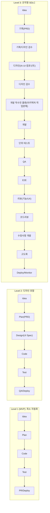
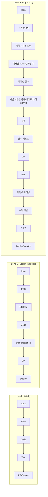
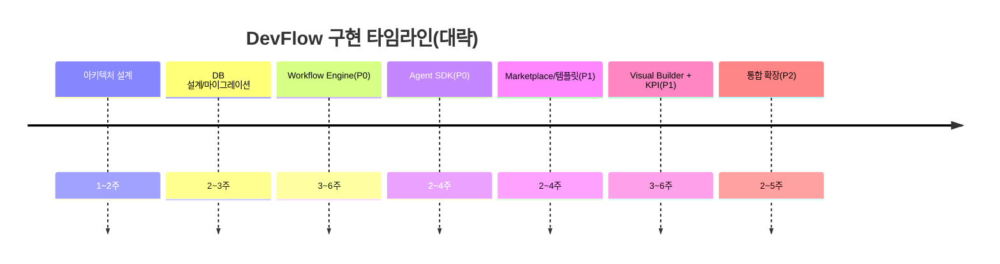

# SPEC

        - Repository: manbalboy/agent-hub
        - Issue: #65
        - URL: https://github.com/manbalboy/agent-hub/issues/65
        - Title: [초장기] 오픈소스의 왕이 될  프로그램 제작

        ## 원본 요청

        ** 해당 아래 기준을 충족하는 프로그래머를 만들고싶어 **

----------------------------------------------------
**CLI를 활용하는게 절대 1번 기능이야 바뀌지 않음**
** manbalboy.com 이라는 도메인이 들어가면 서브도메인이든 포트가 달라도 허용 **
----------------------------------------------------

# DevFlow Agent Hub 설계 프롬프트 문서

## 요약

**요약(Executive Summary)**: gift 레포의 AgentHub는 **GitHub Issue 라벨(`agent:run`) 트리거 → 고정 파이프라인 실행 → PR 생성**까지를 자동화하는 FastAPI 기반 MVP로, “순서를 정하는 주체는 AI가 아니라 워커 코드”라는 원칙 아래 Gemini/Codex/Claude를 **CLI 작업자**로 호출해 단계별로 수행합니다. citeturn3view0turn3view1turn6view0  
본 문서는 이를 기반으로, **Agent Hub를 넘어 “AI Development Platform(Idea→Plan→Design→Code→Test→Deploy)”** 을 지향하는 **DevFlow Agent Hub**를 설계·문서화하기 위한 실행 가능한 아키텍처/기능 요구사항을 제시합니다. 워크플로우는 gift가 이미 시도 중인 “노드/엣지 기반 정의+검증” 방향을 정식 **Workflow Engine**으로 확장하고(시각 편집 포함), Workspace/Marketplace/Dev Integration을 결합해 실제 조직 SDLC에 맞춘 자동화를 제공합니다. citeturn8view0turn8view3  

## 목적 및 핵심 개념

DevFlow Agent Hub의 목적은 **개발 워크플로우 중심의 AI Development Platform**을 구축하는 것이며, 핵심 개념은 “(1) 사람이 이해 가능한 SDLC 단계를 **워크플로우 노드**로 모델링하고, (2) 각 노드는 목적 특화 **Agent(또는 Toolchain)** 로 실행되며, (3) 결과물(PRD·디자인 스펙·코드·테스트·배포 아티팩트)을 **Workspace**에 누적해 다음 단계의 입력으로 재사용”하는 것입니다. gift가 이미 “이슈 읽기→계획→구현→리뷰→수정→테스트→PR”을 코드로 강제한 구조를, **그래프 기반(노드/엣지) + 템플릿 기반(팀/앱/트랙별)** 으로 확장합니다. citeturn3view1turn8view0turn8view2  

## 핵심 아키텍처

아래 구조는 gift의 “API 서버 + 워커 + 오케스트레이터 + 스토어 + 대시보드”를 유지하되, Workflow/Marketplace/Workspace를 1급 도메인으로 승격합니다. gift는 이미 FastAPI/Worker/Orchestrator/Store 구성을 갖고 있으며, jobs/queue/logs 저장과 대시보드 가시화를 제공합니다. citeturn6view0turn7view0turn10view0  

```text
DevFlow Agent Hub
├─ API Layer (FastAPI)
│  ├─ Webhooks / Integrations
│  ├─ Workflow / Runs API
│  ├─ Marketplace API
│  └─ Workspace API
├─ Workflow Engine
│  ├─ Workflow Definition Store (템플릿/버전)
│  ├─ Executor Registry (node type → 실행기)
│  ├─ Run Orchestrator (replay/재시도/상태)
│  └─ Run History (workflow_run / node_run / artifacts)
├─ Agent Marketplace
│  ├─ Agent Spec (prompt, tools, constraints, io schema)
│  ├─ Versioning / Capability Metadata
│  └─ Template Packs (SDLC, 팀별, 앱/트랙별)
├─ Workspace
│  ├─ Project Context (repo snapshot, env, rules)
│  ├─ Artifacts (PRD, UI spec, code, tests, reports)
│  └─ Observability (logs, traces, timelines)
└─ UI
   ├─ Dashboard (runs, logs, status, KPI)
   └─ Visual Workflow Builder (node/edge editor)
```

## 주요 기능

**Workflow Engine(중요도 상)**: gift가 “고정 선형 파이프라인”으로 실행하던 방식을, 저장된 워크플로우 정의로 실행하는 엔진으로 확장합니다. gift는 이미 “워크플로우 스키마/저장소(JSON)/검증 API”를 우선 도입하고, DAG/사이클 검사·entry node·edge 이벤트 타입(success/failure/always) 검증을 정의했습니다. citeturn8view0turn8view2turn8view3  
**Agent Marketplace(중요도 상)**: gift의 “planner/coder/reviewer/escalation”처럼 역할별 CLI 템플릿을 관리하되, 이를 **재사용 가능한 Agent 패키지**로 표준화합니다(입출력 스키마, 필요한 도구, 실패 시 fallback, 예시 프롬프트). gift는 이미 에이전트 템플릿 조회/저장 API와 CLI 연결 확인을 제공합니다. citeturn7view0turn6view2turn4view1  
**Workspace(중요도 상)**: 실행 단위(Job/Run)가 “로그 파일”을 넘어, 단계별 산출물(PRD·리뷰·상태 등)을 구조적으로 저장·버전관리하도록 합니다. gift는 단계별 상태/로그/PR URL 저장 및 workspace 경로 분리를 운영 중입니다. citeturn3view0turn6view1  
**Dev Integration(중요도 상)**: 현재는 GitHub Issues 웹훅 기반이 중심이므로, 이를 **PR/CI/테스트/배포 이벤트**까지 확장합니다. gift는 `issues` 라벨 이벤트를 받아 Job을 만들고, HMAC 서명(`X-Hub-Signature-256`)로 검증합니다. citeturn6view1turn3view0  
**Dashboard & Observability(필수)**: gift는 Job 리스트/상세/로그, 상태 카드, KST 표시, “행위자 라벨” 등 운영 친화 UI를 이미 갖추고, Next 기반 대시보드 프로토타입도 제공합니다. citeturn6view2turn11view0  

## 실제 개발 워크플로우

gift의 “고정 오케스트레이션”은 `prepare_repo → read_issue → write_spec → plan_with_gemini → implement_with_codex → test/commit → review/fix → PR`로 구성되어 있으며, 실패 시 재시도(기본 3회) 및 WIP PR 시도를 포함합니다. citeturn3view1turn6view0  
DevFlow는 이를 **레벨별 템플릿**으로 제공해 “점진적 고도화”를 가능하게 합니다.



## UX 및 사용성 개선 포인트

**템플릿(필수)**: “Level 1~3 SDLC 템플릿” + “앱/트랙(new/enhance/bug)별 템플릿”을 기본 제공(현재 gift는 app_code/track 메타 및 네이밍 규칙을 운영). citeturn6view1  
**Visual Workflow(필수)**: gift가 목표로 명시한 n8n 스타일(노드/엣지 시각 구성)과, 아직 미구현인 “노드 에디터 UI(드래그/연결)”를 제품의 중심 기능으로 승격(ReactFlow 등). citeturn8view0turn8view3  
**상태표시(필수)**: Run/Node 단위로 `queued/running/done/failed`뿐 아니라, “승인 대기(Review Needed) / 재시도 중 / Human-in-the-loop” 상태를 표준화(현재 gift는 상태·단계·로그·재시도 정책을 보유). citeturn3view1turn6view0  
**대시보드(필수)**: gift의 강점(실시간 로그/상태 카드/잡 상세 하이라이트/Next 프록시 구조)을 유지하면서, **Workflow 타임라인·병목 노드·재작업률·리드타임**을 KPI로 추가합니다. citeturn6view2turn11view0  

## gift 레포 기반 개선 포인트

gift는 “작동하는 자동화”가 강점이지만, 플랫폼화에는 아래 격차가 남아 있습니다(일부는 gift 문서에 ‘의도된 범위 제한’으로 명시). citeturn8view3turn6view0  

| gift 현재 격차 | 근거 | DevFlow 제안 해결책 | 기대 효과 |
|---|---|---|---|
| **실행 엔진이 고정 플로우 중심** | 기존 Orchestrator는 고정 파이프라인이며 “실행 엔진 전면 전환 전 단계”로 스키마/검증만 도입 citeturn8view0turn8view3 | **Workflow Engine 정식화**(workflow_id 실행, node executor registry, node_runs 저장) | 팀/앱별 플로우 실험·버전관리, 분기/병렬 확장 |
| **노드 편집 UI/분기/변수 매핑 부재** | 노드 에디터 UI·조건 분기·병렬 노드 미구현 citeturn8view3 | Visual Builder(ReactFlow) + 조건/매핑 DSL + 템플릿 마켓 | 비개발자도 설계 참여, 재사용/공유 용이 |
| **스토리지/관측이 MVP 수준** | jobs/queue JSON 및 확장 언급(예: Postgres), 폴링 기반 UI citeturn6view0turn4view1 | Postgres 중심 Run/Artifact 스키마 + 이벤트 스트림(SSE/WS) | 대규모 이력/검색/리포팅 가능, 운영성 향상 |
| **개발 통합이 GitHub Issues 중심** | issues+labeled 트리거로 Job 생성, PR 자동화 citeturn6view1turn3view0 | PR/CI 결과·배포 이벤트까지 확장, 이슈 트래커도 플러그인화 | “Idea→Deploy” 자동화 완성도 상승 |

## 추천 기술 스택과 구현 로드맵

**추천 기술 스택(기능 우선)**  
백엔드: FastAPI(현행 유지) + 워커 프로세스(현행) + HTTP 클라이언트(httpx) 구성은 gift가 이미 검증한 최소 의존성입니다. citeturn10view0turn6view0  
워크플로우 엔진: (A) **entity["company","Temporal","workflow orchestration platform"]** 기반 “내구성 있는 실행(재시도/스케줄/장기 실행)” 또는 (B) LangGraph 기반 “상태 저장형 에이전트 그래프”를 채택합니다. Temporal은 워크플로우 정의/실행/스케줄을 제공하며, 장애 후에도 실행을 이어가는 특성을 문서화합니다. citeturn0search1turn0search3 LangGraph는 “장기 실행·상태 저장 워크플로우/에이전트”를 그래프 구조로 설계하도록 지원합니다. citeturn0search2turn9search1  
UI: Next.js(이미 dashboard-next 프로토타입 보유) + Visual Builder(ReactFlow 권장) + 실시간 로그 스트림. citeturn11view0turn8view3  
DB: 초기 Postgres(+Redis 선택)로 Run/NodeRun/Artifacts를 정규화(현행 SQLite/JSON은 MVP에 적합). citeturn4view1turn6view0  
LLM: “CLI 호출” 패턴(현행) 유지하되, Marketplace로 추상화(모델 교체/권한/툴링 분리). 예: planner/coder/reviewer/escalation 분리 운영. citeturn4view1turn6view2  

**다음 단계(우선순위 포함)**  
1) **아키텍처 설계(최우선)**: gift의 API/Worker/Store를 기준으로 “Workflow Engine·Marketplace·Workspace” 경계를 확정하고, Run/Artifact 흐름(입력→실행→산출물)을 문서화합니다. citeturn6view0turn8view3  
2) **DB 설계(우선)**: `workflow_definitions`, `workflow_runs`, `node_runs`, `artifacts`, `integrations` 중심 스키마로 이력/검색/재현성을 확보합니다(현행 jobs.json/queue.json/로그 파일의 한계를 흡수). citeturn6view0turn4view1  
3) **Workflow 엔진 설계(우선)**: gift가 제시한 2차 권장사항(“workflow_id 인자 수용, executor registry, node_runs 저장, 기본 플로우 호환, 노드 편집 UI”)을 구현 목표로 삼습니다. citeturn8view3  
4) **Agent SDK(중요)**: Agent Spec(입출력, 프롬프트, 도구, 실패 전략, 산출물 타입)을 표준화하고, CLI/HTTP 모두를 어댑터로 붙일 수 있도록 SDK를 제공합니다(“Cursor+Linear+LangGraph” 컨셉에서 ‘에이전트가 팀의 워크플로우에 자연히 섞이는 경험’을 목표로 함). citeturn9search2turn9search3turn0search2


# DevFlow Agent Hub 설계 문서

## 요약

**요약(Executive Summary)**: manbalboy/gift는 **GitHub Issue에 `agent:run` 라벨이 붙으면 자동으로 Job을 생성하고, Worker가 고정된 단계 순서로 실행해 PR을 만드는 FastAPI 기반 MVP**이며, “순서를 정하는 주체는 AI가 아니라 워커 코드, AI는 CLI로 호출되는 작업자”라는 철학을 명시합니다. citeturn5view0turn9view0 본 문서는 gift의 강점(작동하는 End-to-End 자동화, 대시보드/로그/재시도 정책)을 유지하면서, 이를 **개발 워크플로우 중심 AI Development Platform(DevFlow)** 으로 확장하기 위한 **실행 가능한 아키텍처·기능 중심 요구사항**을 정리합니다(보안 중요도 **하**, 기능 중요도 **상**). citeturn5view0turn5view2turn7view2

## 목적과 핵심 개념

**목적 및 핵심 개념**: DevFlow의 목적은 “Idea→Plan→Design→Code→Test→Deploy”를 실제 개발 조직 SDLC에 맞춰 **워크플로우(그래프)로 모델링**하고, 각 노드를 **역할 기반 Agent(Planner/Designer/Coder/Tester/Reviewer 등)와 Toolchain**으로 실행해 산출물(PRD·UI Spec·코드·테스트 리포트·PR)을 **Workspace에 누적/재사용**하는 것입니다. gift가 이미 고정 파이프라인(prepare_repo→read_issue→…→create_pr)과 재시도(기본 3회), 실패 시 상태/로그/`STATUS.md` 기록 및 Draft PR 시도를 갖춘 점을 기반으로, “정의/실행/관측/재현”이 가능한 플랫폼으로 고도화합니다. citeturn5view0turn5view2turn11view0

## 아키텍처

### 핵심 아키텍처 다이어그램

```text
DevFlow Agent Hub
├─ API Layer (FastAPI)
│  ├─ Webhooks (GitHub/Linear/CI) + Manual Trigger
│  ├─ Workflow API (definitions, validate, runs)
│  ├─ Marketplace API (agent specs, packs)
│  └─ Workspace API (projects, artifacts, permissions-lite)
├─ Workflow Engine
│  ├─ Definition Store (workflow_id, version, templates)
│  ├─ Executor Registry (node.type → executor)
│  ├─ Run Orchestrator (retries, resume, human gate)
│  └─ Run History (workflow_runs, node_runs, events)
├─ Agent Marketplace
│  ├─ Agent Spec (prompt, io schema, tools, policies)
│  ├─ Versioning / Capability Metadata
│  └─ Template Packs (SDLC Level1~3, app/track별)
├─ Workspace
│  ├─ Project Context (repo snapshot, rules, env)
│  ├─ Artifacts (PRD/UI spec/tests/reports)
│  └─ Observability (logs, traces, timeline)
└─ UI (Next.js)
   ├─ Dashboard (status/KPI/runs/logs)
   └─ Visual Workflow Builder (React Flow)
```

gift는 이미 API/Worker/Orchestrator/Store/대시보드 구성을 갖고(`app/main.py`, `app/worker_main.py`, `app/orchestrator.py`, `app/store.py`, `app/dashboard.py`), JSON/SQLite 기반 저장소 추상화와(단일 JobStore 인터페이스) 워크플로우 정의 저장/검증 API를 제공하므로, DevFlow는 이를 **Workflow Engine + Marketplace + Workspace**의 도메인 경계로 재정렬하는 방식이 비용 대비 효과가 큽니다. citeturn5view2turn9view2turn9view3turn5view1

## 기능과 워크플로우

### 주요 기능 목록

아래 우선순위는 “기능 **상** / 보안 **하**” 기준이며, gift에 이미 존재하는 기능은 “기반 있음”으로 표시합니다.

| 기능 | 우선순위 | 핵심 설명 | gift 근거(현황) |
|---|---|---|---|
| Workflow Engine | **P0** | **워크플로우 정의(그래프) 기반 실행**, 분기/루프/휴먼 게이트, `node_runs` 저장, 재시도/재개/리플레이 관점 설계 | 고정 파이프라인 + 1차로 스키마/저장/검증 API 도입, 다음 단계로 executor registry·node_runs·ReactFlow UI 제안 citeturn5view1turn8view1turn9view3 |
| Agent Marketplace | **P0** | 역할 기반 Agent 패키지(프롬프트/도구/입출력 스키마/버전)와 SDLC 템플릿 번들 제공 | CLI 커맨드 템플릿을 JSON으로 분리·대시보드에서 수정/체크/모델 확인 citeturn11view3turn7view1turn9view3 |
| Workspace | **P0** | 프로젝트 단위 컨텍스트/산출물 저장(문서·리포트·스크린샷·PR 링크), 검색/재현/감사 최소 요건 | workspaces 경로 분리, 로그/상태 저장, 브랜치/로그 네이밍 규칙, `artifacts/ux/*.png` 생성 로직 citeturn7view1turn10view4turn5view0 |
| Dev Integration | **P1** | GitHub Issues/PR/Checks, CI, 배포(프리뷰) 이벤트까지 확장 + (선택) Linear 연동 | GitHub issues 웹훅 + 라벨 트리거 + 대시보드에서 이슈 생성/라벨 자동 부착 citeturn11view1turn7view0turn9view3 |
| Dashboard / Observability | **P1** | Run 타임라인·병목·재작업률·리드타임 KPI, 실시간 스트리밍 로그(SSE/WS) | Job 목록/상세/로그, 상태 요약, KST 표시, 행위자 라벨, 폴링 기반 갱신 citeturn7view0turn7view2turn9view3 |
| Agent SDK | **P0** | Agent Spec 표준(입출력, 프롬프트, 툴, 실패전략) + CLI/HTTP 어댑터 + 테스트 하네스 | bash 템플릿 실행기(`bash -lc`), 템플릿 변수 렌더링/에러 가이드 citeturn11view3turn11view2 |

### 실제 개발 워크플로우

**Level 1**은 gift의 “이슈 기반 자동 PR 생성” 철학을 그대로 살리고, **Level 2~3**에서 기획/디자인/QA/E2E/리뷰 루프를 구조화합니다. gift의 최신 워크플로우 템플릿에는 디자이너 단계·E2E·UX 검수·루프가 이미 노드로 정의되어 있어(Level2~3의 일부), 이를 “워크플로우 템플릿 팩”으로 일반화하는 접근이 적합합니다. citeturn8view0turn8view1turn10view4

- **Level 1 (MVP)**: Idea → Plan → Code → Test → PR/Deploy(선택)
- **Level 2 (디자인 포함)**: Idea → PRD → UI Spec → Code → Unit/Integration Test → QA → Deploy
- **Level 3 (조직형 SDLC)**: Idea → 기획(PRD) → 기획/디자인 검수 → 디자인(IA·UI·컴포넌트) → 개발 착수 플랜(작업분해/아키텍처) → 개발 → 단위 테스트 → QA → E2E → 리뷰/코드리뷰 → 수정 개발 → 고도화 → Deploy/Monitor



### UX/사용성 개선 포인트

- **템플릿(필수)**: Level1~3 SDLC 템플릿 + app/track(`new/enhance/bug/long/ultra`)별 템플릿을 기본 제공. gift는 이미 app/track을 Job 메타로 저장하고 라벨/브랜치/로그/워크스페이스를 분리합니다. citeturn7view1turn11view1  
- **Visual Workflow(React Flow, 필수)**: gift의 “n8n 스타일 노드/엣지 기반 + 저장된 워크플로우 실행” 목표를 UI 중심 기능으로 승격하고(드래그/연결/노드 설정 패널), React Flow를 기본 채택(노드 기반 에디터를 위한 MIT 라이선스 오픈소스, 드래그/줌/선택 등 내장). citeturn5view1turn16view2  
- **상태표시(필수)**: `queued/running/done/failed`에 더해 **review_needed(휴먼 승인), retrying, blocked, skipped** 를 추가하고, `node_runs` 단위로 사유/링크(로그/아티팩트)를 노출합니다. gift는 이미 stage enum과 시도 횟수/재시도 정책으로 “진행 상태”를 정형화했습니다. citeturn11view0turn5view0turn10view1  
- **대시보드 KPI(필수)**: 리드타임(이슈→PR), 재작업률(루프 횟수), 실패율(노드별), 병목 노드(대기·실행 시간), 테스트 신뢰도(E2E 통과율) 지표를 추가하고, 현재 폴링 기반을 SSE/WS로 확장(실시간 로그 스트림). gift가 “폴링 리스트+터미널 로그+에러 요약”까지 구현해둔 점을 기반으로 KPI 계층만 추가합니다. citeturn7view2turn9view3turn5view0  

## gift 기반 갭 분석과 기술 선택

### gift 레포 기반 개선 포인트

gift 자체 문서에서 “1차는 실행 엔진 전면 전환 전 단계로 설계/저장/검증만 도입”이라고 명시하며(의도된 범위 제한), 조건 분기/변수 매핑/병렬 실행/노드 편집 UI가 미구현임을 인정합니다. citeturn5view1turn8view1 또한 현재 저장소는 JSON/SQLite 중심이며, 대시보드는 폴링 기반으로 갱신됩니다. citeturn9view2turn7view2 이를 출발점으로 **최소 4개 이상**의 격차와 해결책을 정리합니다.

| 현재 격차(왜 문제인가) | 근거(gift) | 제안 해결책(DevFlow) | 기대 효과 |
|---|---|---|---|
| **정의≠실행**: 워크플로우를 저장/검증하지만 실제 실행은 여전히 Orchestrator 고정 플로우 | “실행 엔진은 기존 Orchestrator 고정 플로우 사용” + 2차 권장( executor registry, node_runs ) citeturn5view1 | **workflow_id 기반 실행 전환(P0)**: `workflow_runs/node_runs` 저장 + executor registry로 `node.type` 실행 | 템플릿 실험/버전관리, 재현성, 노드 단위 재실행 |
| **관측 단위가 Job 중심**: 노드별 시간/산출물/실패 사유가 구조화되지 않음 | stage enum은 있으나 스토어는 Job 레코드 중심 citeturn11view0turn9view2 | **Run 이벤트/아티팩트 스키마(P0)**: node_runs(입력/출력/duration/status) + artifacts(경로/메타) | KPI/병목 분석, 부분 재시도, 감사 가능 |
| **UI 편집/협업 미흡**: Visual Builder 부재로 워크플로우가 “코드/JSON 편집”에 머묾 | “노드 에디터 UI 미구현” 명시, ReactFlow 등 제안 citeturn5view1 | **React Flow 기반 Builder(P1)**: 노드 팔레트 + 속성 패널 + validate/save/preview-run | 비개발자도 설계 참여, 템플릿 공유·확산 |
| **통합 범위 제한**: 트리거가 GitHub Issues 라벨 중심 | issues+labeled+`agent:run` 조건에서 Job 생성 citeturn11view1turn5view0 | **Dev Integration 확장(P1)**: PR 이벤트/CI 결과/배포 프리뷰/이슈 트래커(선택) | “Idea→Deploy” 폐루프 자동화 |
| **에이전트 추상화 부족**: 커맨드 템플릿은 있으나 “능력/입출력/정책” 메타가 약함 | JSON 템플릿 실행(변수 렌더, bash -lc) 중심 citeturn11view3turn11view2 | **Agent SDK/Spec(P0)**: IO schema, tools, fallback, cost/time budget, human-gate 규칙 | 표준화된 Marketplace, 재사용/검증 용이 |

### 추천 기술 스택

gift는 최소 의존성(FastAPI/uvicorn/httpx/pytest)로 빠르게 MVP를 만든 구조이므로, DevFlow도 “**백엔드는 유지**, 워크플로우/스토리지/UI를 단계적으로 확장”이 현실적입니다. citeturn6view0turn5view0turn5view2

- **백엔드**: FastAPI 유지(현행) + Worker 프로세스(현행) + API 경계 정리(Workflow/Marketplace/Workspace) citeturn5view2turn9view3  
- **워크플로우 엔진(Temporal vs LangGraph)**: 두 기술의 “강점이 겹치지만 목적이 다름”을 전제로 선택합니다. Temporal은 워크플로우 정의/실행, 이벤트 히스토리 기반 재개/내구 실행, 장기 실행과 determinism(리플레이)을 핵심으로 설명합니다. citeturn0search5turn16view1turn14search3 LangGraph는 “장기 실행·상태 저장 워크플로우/에이전트”를 위한 인프라로, durable execution, human-in-the-loop, 메모리, 디버깅/배포를 코어 이점으로 제시합니다. citeturn16view0turn12search5  

| 항목 | Temporal | LangGraph | 권장 사용처(DevFlow) |
|---|---|---|---|
| 주 목적 | 분산/장기 프로세스의 **내구 실행** | LLM/에이전트의 **상태 기반 그래프 실행** | DevFlow는 “SDLC 실행”과 “에이전트 추론”을 분리 |
| 강점 | 이벤트 히스토리·리플레이, 장기 실행, 스케줄/메시징, 버전관리/결정성 citeturn0search5turn14search0turn14search3 | durable execution, human-in-loop, memory, 디버깅/가시화/배포 citeturn16view0turn12search5 | 조직형 SDLC(Level3)에는 Temporal, 에이전트 루프는 LangGraph 가능 |
| 비용/복잡도 | 인프라/개념 학습 비용↑(하지만 운영 신뢰성↑) citeturn0search8turn0search5 | 적용이 빠르나 “플랫폼 런타임/관측”은 별도 설계 필요 citeturn16view0turn12search4 | 초기엔 LangGraph-only 또는 gift 엔진 확장, 성장 시 Temporal 고려 |

- **UI**: Next.js 대시보드(현행 `dashboard-next` 기반) + React Flow로 Visual Builder 구성 citeturn3view0turn16view2  
- **DB**: 초기에는 Postgres(Managed)로 `workflow_definitions / workflow_runs / node_runs / artifacts / integrations` 정규화(현행 JSON/SQLite는 개발 편의에 적합) citeturn9view2turn5view0  
- **LLM(모델 추상화)**: gift처럼 “CLI 템플릿(플러그형)”을 유지하되, DevFlow에서는 이를 Agent Spec/SDK로 감싸 **모델/러너/권한을 교체 가능**하게 설계(예: planner/coder/reviewer/escalation 분리, fallback 템플릿) citeturn11view2turn11view3turn10view2  

## 실행 로드맵과 오픈소스 성장 전략

### 구현 로드맵과 우선순위

gift의 2차 권장(Orchestrator에 `workflow_id` 수용, executor registry, `node_runs`, ReactFlow UI)과 Project Features에 정리된 운영·대시보드 자산을 “플랫폼 로드맵”의 뼈대로 삼습니다. citeturn5view1turn7view2turn9view3

| 단계 | 우선순위 | 산출물(핵심) | 예상 난이도 | 기간(대략, 3~10명 OSS) |
|---|---|---|---|---|
| 아키텍처 설계 | **P0** | 도메인 경계(API/Engine/Marketplace/Workspace), Run/Artifact 흐름, 이벤트 모델 | 중 | 1~2주 |
| DB 설계 | **P0** | Postgres ERD + 마이그레이션 + JSON/SQLite→Postgres 브리지 | 중~상 | 2~3주 |
| Workflow Engine 설계/구현 | **P0** | executor registry, `workflow_id` 실행, `node_runs`, 재시도/재개, human-gate | 상 | 3~6주 |
| Agent SDK | **P0** | Agent Spec(IO schema, tools, budgets), CLI/HTTP 어댑터, 테스트 하네스 | 중 | 2~4주 |
| Marketplace + 템플릿 팩 | **P1** | SDLC Level1~3 팩, app/track별 팩, 버전/호환 정책 | 중 | 2~4주 |
| UI/Visual Builder | **P1** | React Flow 편집기, validate/save/preview-run, KPI 대시보드 | 중~상 | 3~6주 |
| 통합 확장 | **P2** | PR/CI/Deploy 이벤트, (선택) 이슈 트래커 연동 | 중 | 2~5주 |



### 오픈소스 스타 확보 전략

스타가 잘 붙는 프로젝트는 “**첫 실행까지의 마찰이 낮고**, 데모/템플릿이 명확하며, 기여 경로가 선명”합니다. Open Source Guides는 README가 신규 사용자를 환영하고(가치/시작법), CONTRIBUTING이 기여 절차를 안내하며, LICENSE가 오픈소스의 전제임을 강조합니다. citeturn16view3 또한 GitHub Docs는 README·라이선스·기여 가이드·Code of Conduct가 기대치와 기여 관리를 돕는다고 정리합니다. citeturn16view4turn13search2

- **README/온보딩(최우선)**: “30초 데모(웹훅→Job→PR)” + “로컬 2커맨드 설치(현재 gift의 setup script 철학 유지)” + “Level1 템플릿으로 즉시 실행”을 전면 배치 citeturn5view0turn7view1  
- **템플릿/데모 팩**: SDLC Level1~3 템플릿을 “복붙 가능한 워크플로우 JSON + UI에서 불러오기”로 제공(기여자는 템플릿 PR로 쉽게 참여) citeturn5view1turn8view0turn9view3  
- **CI/데모 신뢰도**: E2E 데모 리포(샘플 레포)에서 “Issue 생성→PR 생성→로그/아티팩트 링크”가 항상 재현되도록 고정 시나리오 제공(현재 gift는 실환경 웹훅 테스트 스크립트를 제공) citeturn5view0  
- **기여 가이드/커뮤니티 헬스 파일**: `CONTRIBUTING`, `CODE_OF_CONDUCT`, 이슈 템플릿, “good first issue” 라벨 정책을 명확화(기여 허들을 낮춤) citeturn16view3turn13search4turn13search2  
- **커뮤니티 운영 루틴**: 월간 “템플릿 팩 챌린지(예: QA 강화 팩)”, 릴리즈 노트, 디스코드/디스커션 중심 Q&A(초기에는 GitHub Discussions만으로도 충분) citeturn13search0turn13search14

        ## Rule Of Engagement

        - 오케스트레이터가 단계 순서와 재시도 정책을 결정합니다.
        - AI 도구는 컨트롤러가 아니라 작업자(worker)입니다.
        - 변경 범위는 MVP에 맞게 최소화합니다.
        - 구현 단계에서 로컬 실행 포트가 필요하면 충돌 방지를 고려합니다.

        ## Deployment & Preview Requirements

        - 1회 실행 사이클의 결과물은 Docker 실행 가능 상태를 목표로 구현합니다.
        - Preview 외부 노출 포트는 7000-7099 범위를 사용합니다.
        - Preview 외부 기준 도메인/호스트: http://ssh.manbalboy.com:7000
        - CORS 허용 대상은 manbalboy.com 계열 또는 localhost 계열로 제한합니다.
        - 허용 origin 정책(기준값): https://manbalboy.com,http://manbalboy.com,https://localhost,http://localhost,https://127.0.0.1,http://127.0.0.1
        - PR 본문에는 Docker Preview 정보(컨테이너/포트/URL)를 포함합니다.
