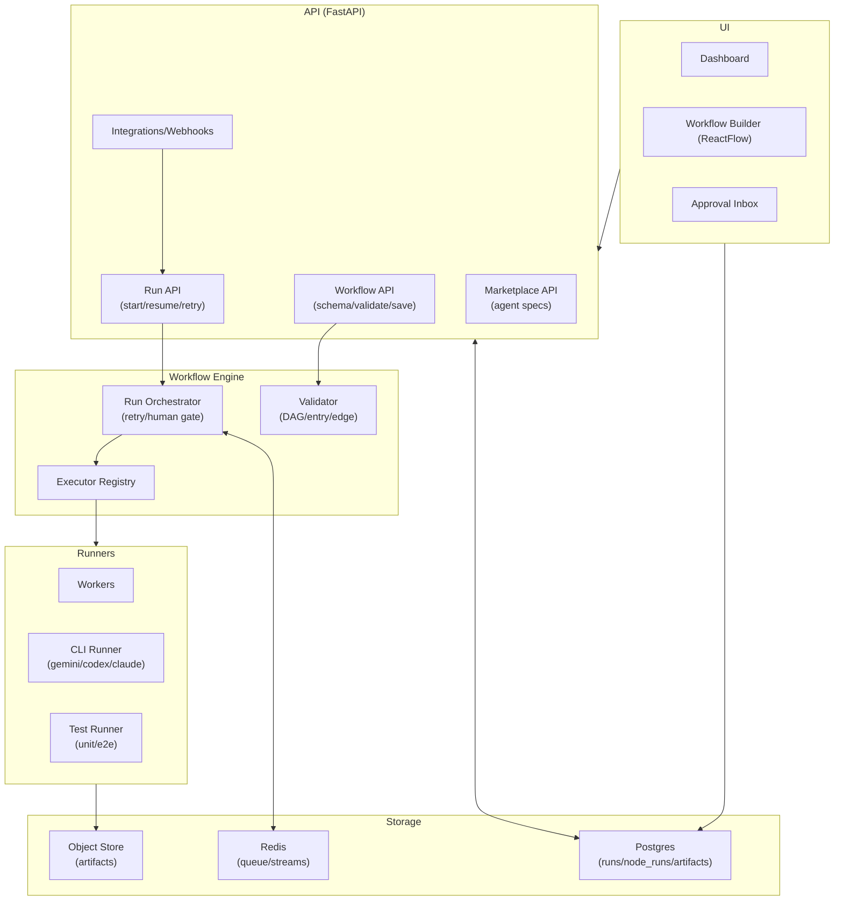
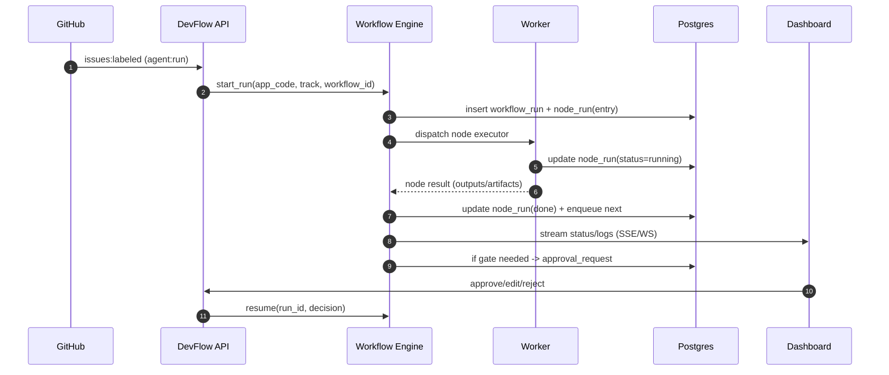

# SPEC

        - Repository: manbalboy/agent-hub
        - Issue: #67
        - URL: https://github.com/manbalboy/agent-hub/issues/67
        - Title: [초장기] 초고도화 방안 및 지속적인 확장가능성을 가진 프로그램으로 개발하는 목표 전략

        ## 원본 요청

        -- 기존레포지토리를 검사해서 아래 내용에서 적용되지 않은 아이디어를 구현해주세요 --

** 절대 ai 사용은 cli로 방법으로 하는걸 기본값으로 가져간다 api 방식은 서브 **

** 기존 n8n과 차별기능을 고도화 할수 있는 플랜을 짜서 장기적인 목표를 짠다 ** 


# DevFlow Agent Hub 확장 설계서

## 요약

**요약(Executive Summary)**: 참고 레포인 gift는 **GitHub Issue에 `agent:run` 라벨이 붙으면 Job을 큐에 적재하고, 별도 Worker가 “이슈 읽기→계획→구현→리뷰→수정→테스트→PR” 순서를 코드로 강제**하는 FastAPI MVP이며, 상태/로그/PR URL을 저장하고 대시보드에서 관측합니다(manbalboy/gift:README.md). citeturn4view0turn13view1turn4view0 DevFlow는 gift의 “작동하는 자동화 + 간결한 운영 경험(대시보드/재시도/로그)”을 유지하면서, gift가 문서로 제시한 **워크플로우 노드 전환(스키마/저장/검증 → 실행 엔진 전환)** 로드맵을 현실적으로 완성해 **개발 워크플로우 중심 AI Development Platform**으로 확장하는 것이 목표입니다(manbalboy/gift:WORKFLOW_NODE_PHASE1_DESIGN.md). citeturn7view2turn7view3turn6view2

## 목적과 핵심 개념

**목적 및 핵심 개념**: DevFlow의 목적은 실제 개발 조직의 SDLC를 **노드/엣지 기반 워크플로우 정의(템플릿/버전)** 로 모델링하고, 각 노드를 목표가 분명한 **Agent/Toolchain 실행기(Planner/Designer/Coder/Tester/Reviewer 등)** 로 수행하며, 산출물(PRD·SPEC·코드·테스트 리포트·UX 스크린샷·PR)을 **Workspace에 아티팩트로 누적/재사용**하는 플랫폼을 구현하는 것입니다. gift는 이미 “앱/트랙별 메타(app_code/track)”, 워크스페이스/로그/브랜치 네이밍 분리, 대시보드에서 이슈 등록·중복 방지·에이전트 템플릿 관리까지 갖추었으므로, DevFlow는 이를 기반으로 **(1) 실행 엔진을 workflow_id 기반으로 전환**하고 **(2) node_runs·artifacts 중심 데이터모델**로 확장해 “정의→실행→관측→재현”을 완결합니다(manbalboy/gift:PROJECT_FEATURES_SUMMARY.md). citeturn8view0turn26view0turn7view2

## 확장 아이디어 개요

아래 아이디어는 “보안 중요도 **하**, 기능 중요도 **상**” 기준이며, gift의 문서/구현이 이미 깔아둔 레일(워크플로우 스키마/저장/검증 API, Quality Gate V2 템플릿, 대시보드/에이전트 템플릿 API)에 맞춰 **실행 가능한 형태**로 구성합니다(manbalboy/gift:WORKFLOW_NODE_PHASE1_DESIGN.md, manbalboy/gift:config/workflows.json). citeturn7view2turn11view1turn25view0

- **아이디어 A — Workflow Engine v2(내구 실행 + node_runs)**: 고정 Orchestrator를 유지하되, `workflow_id`로 **정의 기반 실행**으로 전환해 node 단위 상태/재시도를 표준화. *(목표: 템플릿 실행·버전·재현성)* (manbalboy/gift:WORKFLOW_NODE_PHASE1_DESIGN.md). citeturn5view4turn7view3  
- **아이디어 B — Human Gate(승인/수정/거절) + 재개(Resume)**: 테스트/UX/리뷰 단계에 **휴먼 게이트**를 넣고, 중단/재개를 표준 API로 제공. *(목표: 조직형 SDLC 적합성)* (LangGraph:Interrupts). citeturn19view5  
- **아이디어 C — Visual Workflow Builder(ReactFlow) + 시뮬레이션 런**: n8n 스타일 편집기/검증/저장/프리뷰를 UI 핵심 경험으로 승격. *(목표: 워크플로우를 “코드”가 아니라 “제품 기능”으로)* (manbalboy/gift:WORKFLOW_NODE_PHASE1_DESIGN.md). citeturn6view4turn7view2  
- **아이디어 D — Artifact-first Workspace(표준 아티팩트/메타/검색)**: 로그 파일 중심에서 **아티팩트 중심**으로 전환(리포트·스크린샷·diff summary). *(목표: 재현/검색/리뷰 효율)* (manbalboy/gift:PROJECT_FEATURES_SUMMARY.md). citeturn8view0turn26view2  
- **아이디어 E — Agent Marketplace + Agent SDK(모델/도구 추상화)**: gift의 CLI 템플릿을 **Agent Spec/버전/호환**으로 승격하고 SDK로 실행·테스트·fallback 일관화. *(목표: 재사용/확장/플러그인 생태계)* (manbalboy/gift:ai_commands.example.json). citeturn12view1  
- **아이디어 F — Dev Integrations 확장(이슈→PR→CI→Deploy 이벤트 버스)**: Issues 트리거 중심을 PR/체크/배포 프리뷰까지 확장하고 이벤트 버스로 결합. *(목표: Idea→Deploy 폐루프)* (manbalboy/gift:PROJECT_FEATURES_SUMMARY.md). citeturn6view2turn8view2  

## 아이디어별 상세 설계

### 아이디어 A — Workflow Engine v2

**제안 요약**: gift가 문서로 명시한 “2차 권장(Orchestrator에 `workflow_id`, executor registry, node_runs, ReactFlow UI)”을 DevFlow의 **P0 핵심**으로 삼아, “정의 기반 실행 + node_runs 저장”을 먼저 완성합니다(manbalboy/gift:WORKFLOW_NODE_PHASE1_DESIGN.md). citeturn7view3turn5view4  

**아키텍처(아이디어 A)**  
```text
Workflow Engine v2
├─ WorkflowDefinitionStore (workflows.json → DB로 점진 이관)
├─ ExecutorRegistry (node.type → executor)
├─ RunOrchestrator
│  ├─ retry/backoff 정책
│  ├─ fallback(default_linear_v1)
│  └─ human-gate 대기 상태 지원
└─ RunStore
   ├─ workflow_runs
   └─ node_runs
```

**핵심 컴포넌트**
- **WorkflowDefinitionStore**: gift는 `config/workflows.json`에 **default_workflow_id + workflows 배열**을 두고 Quality Gate V2 템플릿을 운영합니다(manbalboy/gift:config/workflows.json). citeturn11view1turn25view0  
- **Validator**: 노드 중복 ID, from/to, 이벤트 타입(success/failure/always), entry node, DAG(사이클) 검사(이미 구현 완료) (manbalboy/gift:WORKFLOW_NODE_PHASE1_DESIGN.md). citeturn6view4turn7view2  
- **ExecutorRegistry**: 노드 타입별 실행기(예: gh_read_issue, gemini_plan, tester_run_e2e)를 등록 (manbalboy/gift:WORKFLOW_NODE_PHASE1_DESIGN.md). citeturn5view4  

**데이터 흐름**
1) Trigger(웹훅/대시보드 등록) → `workflow_id` 결정(앱/트랙별 override 가능) (manbalboy/gift:PROJECT_FEATURES_SUMMARY.md). citeturn6view2turn8view0  
2) validate 성공 시 run 생성 → entry node부터 executor 실행 → **node_run 기록** 후 다음 edge로 전이. (manbalboy/gift:WORKFLOW_NODE_PHASE1_DESIGN.md). citeturn7view2turn7view3  
3) 워크플로우 로딩 실패 시 fallback: `default_linear_v1` 또는 기존 고정 플로우(문서 권장) (manbalboy/gift:WORKFLOW_NODE_PHASE1_DESIGN.md). citeturn5view4turn7view3  

**API/DB 스키마(요약)**
- API(추가/변경):  
  - `POST /api/runs`(start) / `GET /api/runs/{run_id}` / `POST /api/runs/{run_id}/cancel`  
  - `POST /api/runs/{run_id}/retry-node`(부분 재시도)  
  - 기존 `GET/POST /api/workflows*` 유지(스키마/조회/검증/저장) (manbalboy/gift:WORKFLOW_NODE_PHASE1_DESIGN.md). citeturn7view2turn7view0  
- DB(핵심 테이블):  
  - `workflow_definitions(id, version, app_code, track, json, created_at)`  
  - `workflow_runs(id, workflow_id, app_code, track, status, started_at, ended_at)`  
  - `node_runs(id, run_id, node_id, type, status, attempt, started_at, ended_at, error, outputs_ref)`  

**실패/재시도/휴먼 게이트 정책**
- 기본 재시도: gift는 Job 실패 시 `AGENTHUB_MAX_RETRIES`(기본 3) 재시도를 운영합니다(manbalboy/gift:PROJECT_FEATURES_SUMMARY.md). citeturn6view2turn5view2  
- v2 정책:  
  - node별 `retry_policy`(max_attempts, backoff) 지원  
  - “실패 → node 단위 retry → 그래도 실패 시 run 상태 failed”  
  - 휴먼 게이트는 아이디어 B의 `approval_pending` 상태로 분리(재시도와 독립)

**우선순위/난이도/기간**
- **우선순위: 높음(P0)**  
- 난이도: 중~상(기존 Orchestrator를 “실행기”로 분해해야 함)  
- 기간(3~10명): 3~6주 (manbalboy/gift:WORKFLOW_NODE_PHASE1_DESIGN.md). citeturn5view4  

### 아이디어 B — Human Gate + Resume

**제안 요약**: “자동 머지는 절대 하지 않는다”는 gift 정책을 확장해, DevFlow는 **승인/수정/거절**을 시스템 기능으로 제공하고(특히 QA/E2E/최종 리뷰), 긴 대기 후에도 안전하게 재개합니다(manbalboy/gift:README.md). citeturn13view1  

**아키텍처(아이디어 B)**  
```text
Human Gate
├─ GateRule (node.type, 조건, 요구 입력 스키마)
├─ ApprovalService
│  ├─ create_request
│  ├─ approve/edit/reject
│  └─ resume(run_id, node_id)
└─ UI
   ├─ Approval Inbox
   └─ Diff/Artifact Viewer
```

**핵심 컴포넌트**
- **Interrupt/Resume 메커니즘**: LangGraph는 interrupt가 발생하면 상태를 persistence로 저장하고, 재개 전까지 무기한 대기할 수 있음을 문서화합니다(LangGraph:Interrupts). citeturn19view5  
- **Persistence 필요성**: LangGraph는 checkpointer가 state를 thread에 저장하고(HITL, time-travel 등 가능), 휴먼 게이트에 checkpointer가 필요하다고 설명합니다(LangGraph:Persistence). citeturn19view3  
- **실무 배치**: Quality Gate V2 템플릿은 “UX E2E 검수(PC/모바일 스샷) → 수정 → 재 E2E → 최종 리뷰 게이트” 노드를 이미 포함합니다(manbalboy/gift:config/workflows.json). citeturn25view0turn11view1  

**데이터 흐름**
1) node executor가 gate 조건을 만족하면 `approval_request` 생성 → run은 `approval_pending`으로 전환  
2) 사용자가 UI에서 approve/edit/reject  
3) approve/edit면 node 재실행 또는 다음 노드로 전이, reject면 run은 `blocked` 또는 `failed`  

**API/DB 스키마(요약)**
- API: `POST /api/approvals` / `POST /api/approvals/{id}/approve|edit|reject` / `POST /api/runs/{run_id}/resume`  
- DB: `approval_requests(id, run_id, node_id, status, payload, decision, decided_by, decided_at)`

**실패/재시도/휴먼 게이트 정책**
- 휴먼 게이트 노드는 **재시도보다 우선**(retry로 해결 불가한 설계/UX 판단을 분리)  
- interrupt를 사용하는 경우, LangGraph는 “interrupt는 노드를 재실행하며, interrupt 이전 부작용은 idempotent해야 한다”는 규칙을 제시합니다(LangGraph:Interrupts). citeturn19view6  

**우선순위/난이도/기간**
- **우선순위: 높음(P0~P1)** (Level3 SDLC에 필수)  
- 난이도: 중(상태 모델/UX 설계가 핵심)  
- 기간: 2~4주  

### 아이디어 C — Visual Workflow Builder + 시뮬레이션 런

**제안 요약**: gift는 “n8n 스타일(노드/엣지 시각 구성) + 저장된 워크플로우 정의 기반 실행”을 목표로 삼고, 1차 범위로 스키마/저장/검증 API를 이미 도입했습니다(manbalboy/gift:WORKFLOW_NODE_PHASE1_DESIGN.md). citeturn6view4turn7view2 DevFlow는 이를 “편집기 + 프리뷰 실행”까지 올려 **워크플로우를 제품 기능으로 완성**합니다.

**아키텍처(아이디어 C)**  
```text
Workflow Builder
├─ ReactFlow Canvas
│  ├─ Node Palette (SUPPORTED_NODE_TYPES)
│  ├─ Edge Editor (on: success/failure/always)
│  └─ Property Panel (node params, retry, gate)
├─ Validation/Preview
│  ├─ server-side validate_workflow
│  └─ dry-run executor (no side effects)
└─ Publishing
   ├─ versioning(workflow_id + vN)
   └─ rollback(default_workflow_id)
```

**핵심 컴포넌트**
- 서버 스키마/검증: `GET /api/workflows/schema`, `POST /api/workflows/validate`, `POST /api/workflows`(저장/업데이트) (manbalboy/gift:WORKFLOW_NODE_PHASE1_DESIGN.md). citeturn7view2turn7view0  
- 검증 항목: DAG 여부, entry_node_id 유효성, edge 이벤트 타입 등 (manbalboy/gift:WORKFLOW_NODE_PHASE1_DESIGN.md). citeturn6view4  

**데이터 흐름**
1) UI에서 workflow 편집 → validate 호출  
2) validate OK면 save→새 phiên(version) 생성  
3) preview-run(드라이런)은 “각 노드가 어떤 입력/출력 스키마를 요구하는지”만 확인(실제 git push/PR 생성은 금지)

**API/DB 스키마(요약)**
- API: `POST /api/workflows/{id}/preview-run`(시뮬레이션)  
- DB: `workflow_definitions`에 `status(draft/published/deprecated)` 추가

**실패/재시도/휴먼 게이트 정책**
- validate 실패는 저장 거부(문서 권장) (manbalboy/gift:WORKFLOW_NODE_PHASE1_DESIGN.md). citeturn5view4turn7view3  
- 편집 중에도 fallback(기본 워크플로우/고정 플로우) 유지 (manbalboy/gift:WORKFLOW_NODE_PHASE1_DESIGN.md). citeturn7view3  

**우선순위/난이도/기간**
- **우선순위: 중~높음(P1)**  
- 난이도: 중(ReactFlow + 서버 검증 연결)  
- 기간: 3~6주  

### 아이디어 D — Artifact-first Workspace

**제안 요약**: gift는 현재 logs와 Job 메타 중심이며, 앱/트랙 기준으로 브랜치/로그/워크스페이스를 분리하고, UX E2E 스크린샷 같은 산출물도 워크플로우 노드에 포함합니다(manbalboy/gift:PROJECT_FEATURES_SUMMARY.md, manbalboy/gift:config/workflows.json). citeturn8view0turn25view0turn11view1 DevFlow는 이를 **아티팩트 표준**으로 확장해 “검색/재현/리뷰”를 강화합니다.

**아키텍처(아이디어 D)**  
```text
Workspace & Artifacts
├─ Artifact Registry (type, schema, retention)
├─ Object Store (S3 compatible)
├─ Metadata Store (Postgres)
└─ UI
   ├─ Artifact Viewer (md, diff, screenshots)
   └─ Run Timeline (node_runs + artifacts)
```

**핵심 컴포넌트**
- **Artifact 표준 타입**: `spec.md`, `plan.md`, `review.md`, `test_report.json`, `e2e_screenshots/*`, `code_change_summary.md`, `status.md`, `pr_link`  
- **App Namespace**: gift의 app_code/track, 네이밍 분리 규칙은 그대로 유지 (manbalboy/gift:PROJECT_FEATURES_SUMMARY.md). citeturn26view0turn8view0  

**데이터 흐름**
1) node 실행 결과는 “stdout 로그”뿐 아니라 artifact로 저장(경로+메타)  
2) UI는 run 타임라인에서 각 node_run의 출력 artifact를 클릭해 확인  
3) “재실행”은 특정 node_run을 기준으로 입력 아티팩트를 그대로 재사용(재현성)

**API/DB 스키마(요약)**
- API: `GET /api/runs/{run_id}/artifacts`, `GET /api/artifacts/{id}`  
- DB: `artifacts(id, run_id, node_id, type, uri, mime, size, hash, created_at)`

**실패/재시도/휴먼 게이트 정책**
- 실패 시 “마지막 40줄 로그” 자동 노출 같은 운영 UX는 유지(실환경 웹훅 테스트 스크립트가 동일 패턴을 이미 채택) (manbalboy/gift:README.md). citeturn13view1  

**우선순위/난이도/기간**
- **우선순위: 중(P1)**  
- 난이도: 중(DB+스토리지+UI 연결)  
- 기간: 3~5주  

### 아이디어 E — Agent Marketplace + Agent SDK

**제안 요약**: gift는 `ai_commands.json`에 **planner/coder/reviewer/escalation** CLI 템플릿을 두고, 대시보드에서 템플릿 조회/저장·CLI 체크·모델 확인 API를 제공합니다(manbalboy/gift:PROJECT_FEATURES_SUMMARY.md). citeturn8view0turn8view2 DevFlow는 이를 “Agent Spec + 실행 SDK”로 격상해, **모델/도구/입출력/예산/폴백**을 표준화합니다.

**아키텍처(아이디어 E)**  
```text
Agent Platform
├─ Agent Spec Registry
│  ├─ versions
│  ├─ io schema
│  └─ tool requirements
├─ Agent SDK
│  ├─ CLI adapter (gif t 방식 유지)
│  ├─ HTTP adapter
│  └─ test harness (golden prompts)
└─ Marketplace UI
   ├─ browse/search
   └─ install to workflow
```

**핵심 컴포넌트**
- **CLI 기반 실행 유지**: gift의 예시 템플릿은 `gemini/codex/claude`를 표준 입출력(파일/JSON→markdown 변환)로 연결합니다(manbalboy/gift:ai_commands.example.json). citeturn12view1  
- **모델 추상화**: node executor는 “Agent Spec(역할)”만 참조하고, 실제 실행은 환경별 runner가 담당

**데이터 흐름**
1) workflow node(type=gemini_plan 등) → executor가 agent_spec 버전을 조회  
2) prompt_builder가 `{prompt_file}` 등 변수를 렌더 → runner 실행  
3) 결과는 artifact로 저장하고, 실패 시 fallback spec(또는 fallback command)로 재시도

**API/DB 스키마(요약)**
- API: `GET/POST /api/agents`(스펙 등록), `GET /api/agents/{id}/versions`  
- DB: `agent_specs(id, name, description)`, `agent_versions(id, agent_id, semver, command_tpl, io_schema, defaults, created_at)`

**실패/재시도/휴먼 게이트 정책**
- 기본: planner/coder/reviewer 분리 + fallback 키를 이미 제공(예: planner_fallback, coder_fallback) (manbalboy/gift:ai_commands.example.json). citeturn12view1  
- DevFlow: 비용/시간 budget 초과 시 escalation 또는 휴먼 게이트로 전환(보안보다 “기능 완주” 우선)

**우선순위/난이도/기간**
- **우선순위: 높음(P0)** (마켓플레이스 생태계의 기반)  
- 난이도: 중  
- 기간: 2~4주  

### 아이디어 F — Dev Integrations + 이벤트 버스

**제안 요약**: gift는 `issues+labeled` 웹훅과 `POST /api/issues/register`를 통해 이슈 생성·라벨 부착·Job 생성까지 자동화하고, 중복 방지(queued/running 기존 Job 연결)도 구현했습니다(manbalboy/gift:PROJECT_FEATURES_SUMMARY.md). citeturn6view2turn26view0 DevFlow는 이를 PR/CI/Deploy 이벤트까지 확장해 “Idea→Deploy” 폐루프를 강화합니다.

**아키텍처(아이디어 F)**  
```text
Integrations
├─ Event Ingest
│  ├─ GitHub (issues/pr/checks)
│  ├─ CI (GitHub Actions 등)
│  └─ Deploy (preview/prod)
├─ Event Bus (Redis streams 또는 Postgres outbox)
└─ Workflow Triggers
   ├─ start run
   ├─ resume run
   └─ update artifacts
```

**핵심 컴포넌트**
- Trigger 다양화: `agent:run` 라벨 외에 “PR opened → 테스트 워크플로우 실행”, “CI fail → 수정 워크플로우 전환”  
- Event Bus: 단순 큐(JSON/SQLite 폴링)에서 **이벤트 스트림 기반**으로 확장(관측/리플레이 용이)

**데이터 흐름**
1) 이벤트 수신 → 표준 event로 정규화(`event_type`, `repo`, `ref`, `payload`)  
2) 트리거 매핑(규칙) → run 시작/재개/노드 스킵 등 실행 제어  
3) 결과(체크/배포 URL)는 artifact로 저장

**API/DB 스키마(요약)**
- DB: `integration_events(id, type, source, payload, received_at)`, `trigger_rules(id, match, action)`  
- API: `POST /api/triggers/test`(규칙 검증), `GET /api/events`(관측)

**실패/재시도/휴먼 게이트 정책**
- 외부 의존성 실패(gh auth, 외부 네트워크 등)는 운영 유의사항으로 명시되어 있으므로, 이벤트 재수신/재처리 전략이 필요합니다(manbalboy/gift:PROJECT_FEATURES_SUMMARY.md). citeturn8view2  

**우선순위/난이도/기간**
- **우선순위: 중(P1~P2)**  
- 난이도: 중  
- 기간: 2~5주  

## 통합 아키텍처

gift는 현재 “API 서버 + 워커 + 오케스트레이터 + 저장소(JSON/SQLite) + 대시보드” 형태로 작동하며, 워크플로우 스키마/저장/검증 API를 이미 추가했습니다(manbalboy/gift:PROJECT_FEATURES_SUMMARY.md, manbalboy/gift:WORKFLOW_NODE_PHASE1_DESIGN.md). citeturn6view1turn7view2 DevFlow 통합 아키텍처는 이를 “Engine/Marketplace/Workspace/Integrations”로 재구성합니다.

**통합 텍스트 트리**  
```text
DevFlow (Integrated)
├─ UI (Next.js)
│  ├─ Dashboard (runs, logs, KPIs, approvals)
│  └─ Workflow Builder (ReactFlow)
├─ API (FastAPI)
│  ├─ Webhooks / Integrations
│  ├─ Workflows (schema/validate/save/publish)
│  ├─ Runs (start/cancel/resume/retry-node)
│  ├─ Marketplace (agents/specs/versions)
│  └─ Workspace (projects/artifacts/search)
├─ Workflow Engine
│  ├─ Validator (DAG, entry, edge conditions)
│  ├─ Executor Registry (node.type → executor)
│  ├─ Run Orchestrator (retries, human gate)
│  └─ Runner Layer (CLI/HTTP)
└─ Infra
   ├─ Postgres (definitions/runs/node_runs/artifacts)
   ├─ Redis (queue/cache/streams, optional)
   ├─ Object Store (S3 compatible)
   └─ Kubernetes (API/worker scale-out)
```

**컴포넌트 다이어그램(mermaid)**  


**시퀀스 다이어그램(mermaid)**  


**Temporal vs LangGraph 위치 선정(권장 운영 모델)**  
- **Temporal**은 워크플로우 실행이 이벤트 히스토리에 기록되어 장애 복구/내구 실행을 제공하며, 워크플로우가 “수년” 실행될 수 있음을 명시합니다(Temporal:Workflow, Temporal:Events/Event History). citeturn21view0turn20view0 DevFlow가 “조직형 SDLC(Level3) + 장기 대기(휴먼 게이트) + 재시도”를 강하게 요구하면 Temporal 도입 가치가 큽니다(Temporal:Retry Policies). citeturn20view1  
- **LangGraph**는 checkpointer 기반 persistence로 체크포인트/threads를 제공하고, interrupt로 실행을 일시정지한 뒤 재개하는 HITL 패턴을 공식 문서로 제공합니다(LangGraph:Persistence, LangGraph:Interrupts). citeturn19view3turn19view5  
- 실행 가능 권장안: **1) 단기(4~8주)**는 gift 방식(내장 엔진)으로 v2를 완성하고, **2) 규모/신뢰성 요구가 커지면** Temporal(오케스트레이션) + LangGraph(에이전트 루프)로 분리.

## 구현 로드맵과 우선순위

gift는 “나중에 확장”으로 Postgres, 멀티 워커/분산 큐, SSE/WS 실시간 로그를 제시하므로(manbalboy/gift:README.md), citeturn13view2 DevFlow도 이를 단계적으로 반영합니다.

### 단계별 산출물, 병렬/순차, 기간, 리스크

| 단계 | **우선순위** | 산출물(명확한 완료 기준) | 병렬/순차 | 기간(대략) | 리스크 |
|---|---|---|---|---:|---|
| Phase 1 | **높음** | Workflow Engine v2: `workflow_id` 실행 + ExecutorRegistry + `node_runs` 저장 + fallback(`default_linear_v1`) | 순차 | 3~6주 | 상 |
| Phase 2 | **높음** | Agent SDK v1: Agent Spec/버전/폴백 + CLI 어댑터 표준화 + 테스트 하네스 | 병렬(Phase1 후반) | 2~4주 | 중 |
| Phase 3 | **중** | Postgres 이관: runs/node_runs/artifacts + 마이그레이션 스크립트 + 검색 기본 | 병렬 | 2~3주 | 중 |
| Phase 4 | **중** | Human Gate: approvals API + UI Inbox + resume 흐름 | 순차(Phase1 필요) | 2~4주 | 중 |
| Phase 5 | **중** | Visual Builder: ReactFlow 편집/검증/저장/프리뷰 런 | 병렬 | 3~6주 | 중~상 |
| Phase 6 | **낮음~중** | Integrations 확장: PR/CI/Deploy 이벤트 + 트리거 룰 엔진 | 병렬 | 2~5주 | 하~중 |

**리스크 관리 포인트**
- “편집 중에도 fallback 유지”는 gift 문서의 운영 규칙을 그대로 채택합니다(manbalboy/gift:WORKFLOW_NODE_PHASE1_DESIGN.md). citeturn7view3  
- 외부 의존성(gh auth, 네트워크, npm 설치 등)은 운영 유의사항으로 이미 정리되어 있으므로, 타임아웃/재시도/재처리 시나리오를 Runbook으로 문서화합니다(manbalboy/gift:PROJECT_FEATURES_SUMMARY.md). citeturn8view2  

## 운영과 오픈소스 성장 전략

### 운영·관측과 비용 추정

**관측(Observability) 설계**: gift는 실시간 로그, 단계/시도 하이라이트, 오류 요약, 행위자 라벨(ORCHESTRATOR/CODER/PLANNER/REVIEWER 등) UX를 갖추고 있으므로(manbalboy/gift:PROJECT_FEATURES_SUMMARY.md), citeturn8view1 DevFlow는 이를 기반으로 아래를 추가합니다.
- **로그**: run_id/node_run_id 키로 구조화(JSON) + 원문 로그(텍스트) 저장  
- **메트릭**: node별 duration/실패율/재시도 횟수, E2E 통과율, “이슈→PR 리드타임”  
- **트레이싱(선택)**: RunOrchestrator→executor→runner 경로를 분산 추적(필요 시)

**인프라 가정**: 배포 환경 미지정이므로 “일반적 클라우드”를 가정하고, Managed Postgres + (선택) Redis + Kubernetes로 기술합니다(요청 가정). 또한 gift가 systemd 기반 24/7 운영 예시를 제공하므로 초기에는 VM+systemd도 옵션으로 유지합니다(manbalboy/gift:README.md). citeturn13view1turn13view2  

**월 비용(대략, USD 기준 예시)**: 아래는 “작게 시작 → 사용량 증가” 관점의 범위입니다. EKS는 표준 지원 티어에서 **클러스터당 시간당 $0.10**을 명시합니다(AWS:EKS Pricing). citeturn18view0 또한 ALB는 시간당 고정요금 + LCU 요금이며, AWS 문서 예시에서 월 $22~$88 수준 사례를 제공합니다(AWS:ELB Pricing). citeturn24view1turn24view0 RDS/ElastiCache는 인스턴스/스토리지/전송량에 따라 변동하며, 정확치는 각 클라우드의 계산기를 사용해 산정하는 것이 정석입니다(AWS:RDS Postgres Pricing). citeturn24view4  

| 구성 | 포함 리소스 | 월 비용 범위(대략) | 비고 |
|---|---|---:|---|
| Dev(최소) | VM 1대 + SQLite/파일 스토어 + systemd | $20~$120 | gift 운영 방식 그대로(빠른 PoC) (manbalboy/gift:README.md). citeturn13view1 |
| Small(권장) | EKS 1클러스터 + Managed Postgres + Redis(선택) + Object Store + ALB | $250~$900 | EKS control plane만 약 $73/월 규모부터 시작, ALB는 사용량에 따라 변동(AWS:EKS/ELB). citeturn18view0turn24view1 |
| Medium(성장) | 워커 스케일아웃 + 관측 스택(Managed) + CI/프리뷰 환경 | $800~$3,000 | 워커/테스트 실행량과 LLM 호출량이 비용의 상단을 결정 |

        ## Rule Of Engagement

        - 오케스트레이터가 단계 순서와 재시도 정책을 결정합니다.
        - AI 도구는 컨트롤러가 아니라 작업자(worker)입니다.
        - 변경 범위는 MVP에 맞게 최소화합니다.
        - 구현 단계에서 로컬 실행 포트가 필요하면 충돌 방지를 고려합니다.

        ## Deployment & Preview Requirements

        - 1회 실행 사이클의 결과물은 Docker 실행 가능 상태를 목표로 구현합니다.
        - Preview 외부 노출 포트는 7000-7099 범위를 사용합니다.
        - Preview 외부 기준 도메인/호스트: http://ssh.manbalboy.com:7000
        - CORS 허용 대상은 manbalboy.com 계열 또는 localhost 계열로 제한합니다.
        - 허용 origin 정책(기준값): https://manbalboy.com,http://manbalboy.com,https://localhost,http://localhost,https://127.0.0.1,http://127.0.0.1
        - PR 본문에는 Docker Preview 정보(컨테이너/포트/URL)를 포함합니다.--


        ** 절대 우선순위 ** 
        최소 기능 구현이 미흡합니다. 
        절대경로 
        /home/docker/agentHub/workspaces/main

        상대경로 
        workspaces/main


        위의 폴더 안의 프로젝트 기능들을 살펴보고 모두 구현해주세요 (비슷 동일한 사용법으로 )

        위의 요구사항이 제일 우선순위가 높습니다. 


        아래의 요구사항도 수정해주세요 우선순위가 높습니다. 

  - 실행이 백그라운드 워커가 아니라 “조회 API 호출 시 1스텝 진행” 구조입니다.
      - run 생성은 큐만 쌓음: create_run:88
      - 실제 실행은 refresh_run에서만 진행: refresh_run:125
      - 그래서 GET /runs/... 류를 안 치면 실행이 안 굴러갑니다: API get_run:199
  - 프론트가 SSE 이벤트 받을 때 다시 getRun/getConstellation 호출해서 실행을 “밀어주는” 구조입니다.
      - App onRunStatus:106
      - 즉 UI/클라이언트가 사실상 실행 트리거 역할을 합니다.
  - 그래프의 edges가 실행 로직에서 사실상 무시됩니다. 노드 배열 순서(sequence)만 사용합니다.
      - sequence 부여:96
      - queued 첫 노드 실행:147
      - constellation 링크도 edge가 아니라 단순 인접 연결: constellation:235
  - 아티팩트가 실제 실행 결과물이 아니라 고정 템플릿 문자열입니다.
      - write_artifact 호출:199
  - 아티팩트 조회 API가 없고 UI도 경로 문자열만 보여줍니다.
      - artifact_path 사용 위치:290
  - agents API는 있으나 Web UI에서 연결되지 않습니다.
      - agents API:1
  - 워크플로우는 run 1번이라도 생기면 수정 불가(409)라 운영 UX가 매우 딱딱합니다.
      - update 제약:146 


-- ** workspaces/main 안에 파일은 읽기만 해야합니다. 수정이나 삭제 하면안됨 **